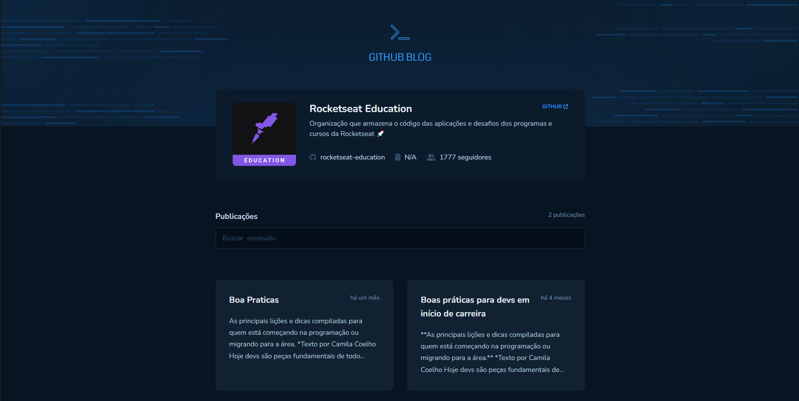
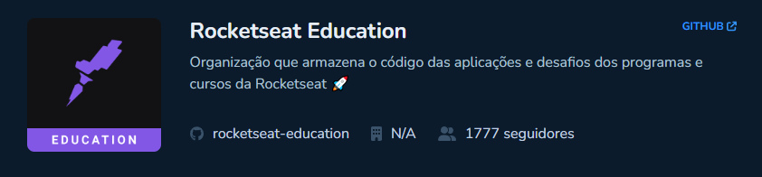
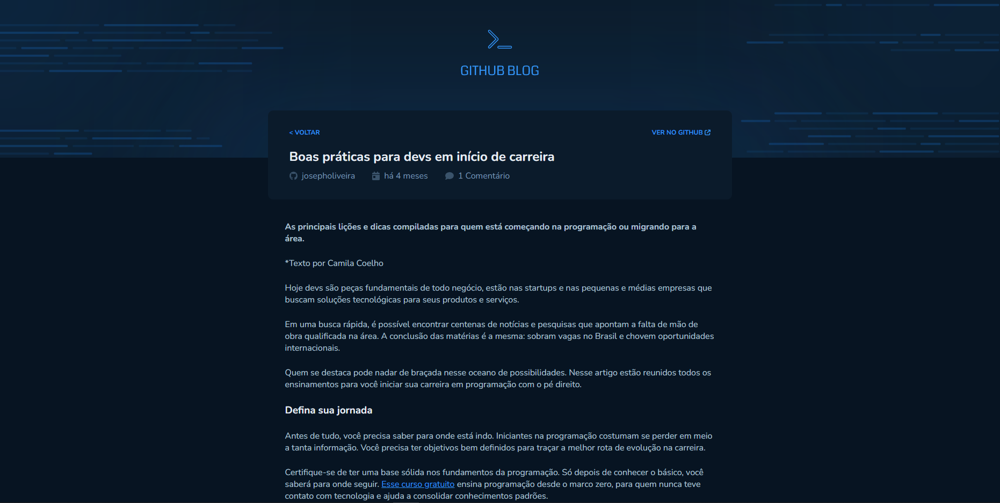
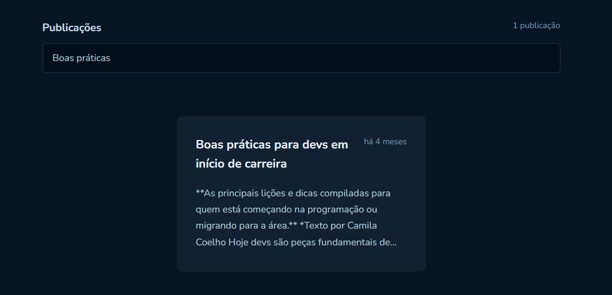

## GithubBlog

This application is a challenge from the rocketSeat programming course. Where the application is a blog one can see issues from a repository.

Esta aplicação é um desafio do curso de programação rocketSeat. Onde a aplicação é um blog que se pode ver issues de um repositório.

In it there will be a header where the user information appears, and also a list of issues.

Nela haverá uma header onde aparece as informações de usuario, e também uma lista de issues.

By clicking on an issue you will be redirected to its more detailed post.

Clicando em um issue você será redirecionado para o post mais detalhado da mesma.

 

You can also search for a specific issue with the search bar.

Você também pode pesquisar por uma issue especifica com a barra de pesquisa.